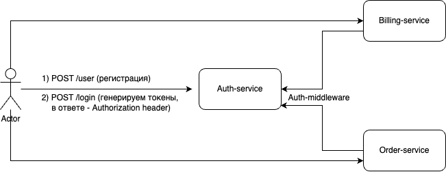

# API for online store.

Связка микросервисов, содержащая сервис авторизации, сервисы заказа и биллинга.

__Требования__:
- __Сервис авторизации__ должен проверять логин и пароль пользователя и выдавать ему токен для обращения к другим сервисам. Во всех дальнейших запросах токен должен передаваться в хедере 'Authorization: Bearer <token>'. Сервис должен удовлетворять базовым требованиям безопасности.
- __В сервисе биллинга__ должна быть возможность положить деньги на аккаунт пользователя, проверить баланс и снять деньги.
- __Сервис заказа__ должен позволять создать заказ, посмотреть предыдущие заказы. При заказе нужно снимать с пользователя деньги, при недостаточном балансе возвращать ошибку и сохранять неуспешный заказ.


# Usage

1. Склонировать репозиторий:  ```git clone https://github.com/Morozhkaa/CRUD-HW.git```
2. Зайти в директорию и переключиться на hw-3 ветку: ```cd CRUD-HW && git checkout hw-3```
3. Добавить в репозиторий .env файл, используя в качестве примера .env.example.
4. Запустить сервис: ```make run```.
5. Документацию по конкретному сервису можно посмотреть в Readme к нему.


## General architecture




## Basic safety requirements:

1. Пароли захшированы с использованием salt, secret.
2. Аутентификация с использованием access, refresh JWT токенов (актуальны 1 и 60 минут соотвественно).
3. Пароли к БД, Salt, Secret храним в отдельном .env файле.
4. Пароли нетривиальные и разные к разным БД.


## Testing:

В директории test находится небольшая программа на Go, которая тестирует работу нашего приложения по следующему сценарию:

* Создать пользователя
* Положить деньги на счет пользователя
* Сделать заказ, на который хватает денег
* Убедиться, что деньги сняли
* Сделать заказ, на который не хватает денег
* Проверить, что заказ сохранился как неуспешный
* Проверить, что баланс не изменился

Проверить, что скрипт отработал успешно, можно перейдя в логи контейнера script.